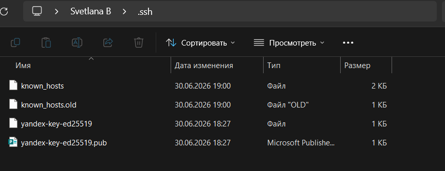
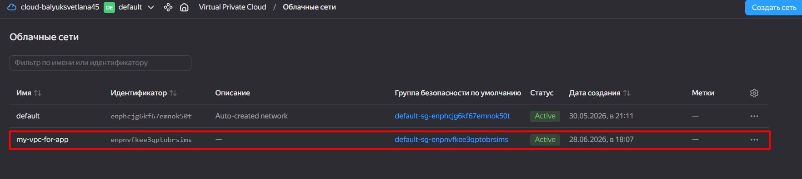
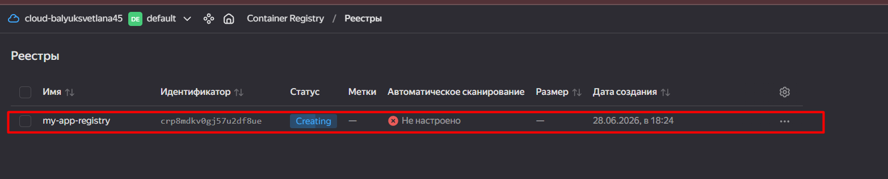
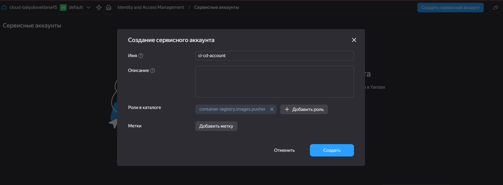
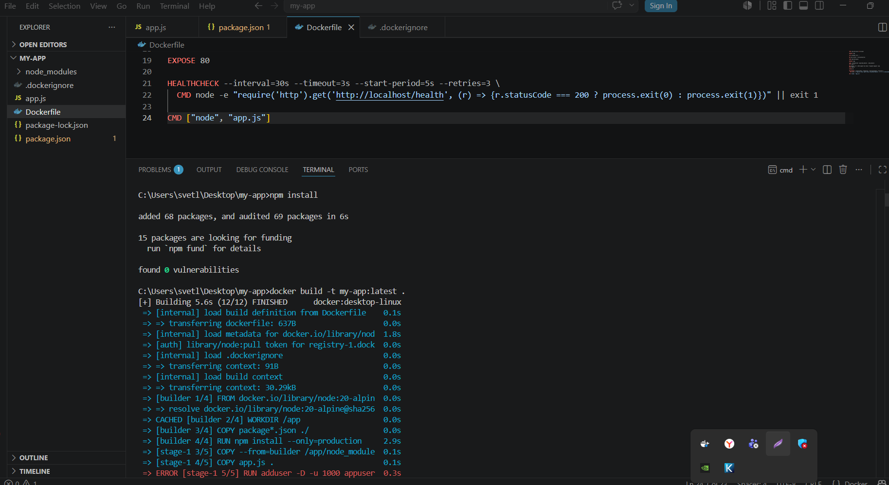
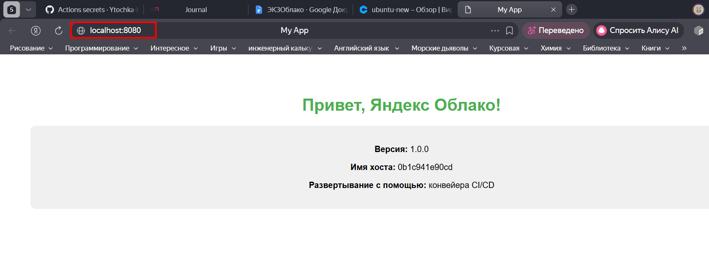
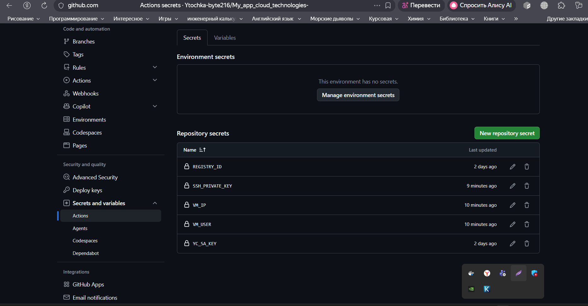
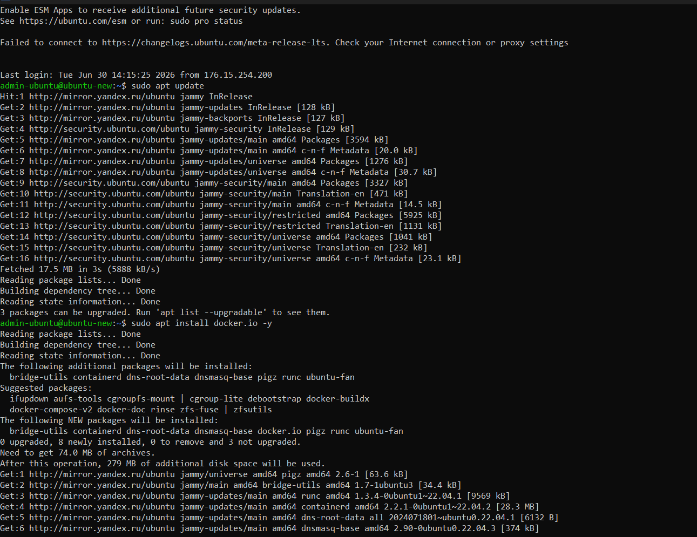
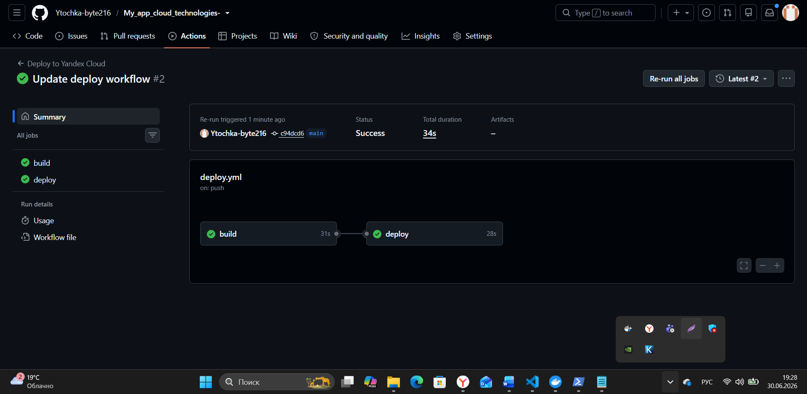
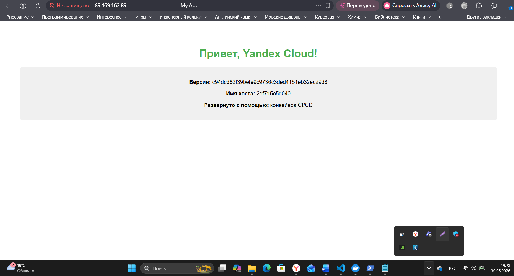

# Автоматизация развертывания веб-приложения в Yandex Cloud через CI/CD

## Описание проекта

Автоматизированное развертывание веб-приложения на Node.js в Yandex Cloud с использованием Docker и GitHub Actions.

**Стек:** Yandex Compute Cloud, Yandex Container Registry, Docker, GitHub Actions, Node.js + Express, SSH.

---

## Структура проекта

```
my-app/
 .github/workflows/deploy.yml   # CI/CD пайплайн app.js                          # Веб-приложение package.json                    # Зависимости
 Dockerfile                      # Конфигурация Docker
 README.md                       # Документация
```


## Этап 1: Подготовка облачной инфраструктуры

### 1.1 SSH-ключи

Сгенерирована пара SSH-ключей для подключения к ВМ:

```bash
ssh-keygen -t ed25519 -f C:\Users\svetl\.ssh\yandex-key-ed25519
```

- Приватный ключ: `yandex-key-ed25519`
- Публичный ключ: `yandex-key-ed25519.pub`



---

### 1.2 Сеть и подсеть

В Yandex Cloud созданы:

| Ресурс | Название |
|--------|----------|
| Сеть | `my-vpc-for-app` |
| Подсеть | `my-subnet` |
| Зона | `ru-central1-a` |
| CIDR | `192.168.10.0/24` |




---

### 1.3 Группа безопасности

Использована группа безопасности по умолчанию:

| Название | `default-sg-enpnvfkee3qptobrsims` |
|----------|-----------------------------------|

**Правила:**

| Направление | Порт | Протокол | Источник/Назначение |
|-------------|------|----------|---------------------|
| Входящий (SSH) | 22 | TCP | 0.0.0.0/0 |
| Входящий (HTTP) | 80 | TCP | 0.0.0.0/0 |
| Исходящий | 0-65535 | Any (Любой) | 0.0.0.0/0 |


---

### 1.4 Виртуальная машина

Создана ВМ с параметрами:

| Параметр | Значение |
|----------|----------|
| Имя | `my-app-vm-final` |
| ОС | Ubuntu 22.04 LTS |
| vCPU/RAM | 2 / 2 ГБ |
| Публичный IP | `89.169.163.89` |
| Логин | `admin-ubuntu` |


---

### 1.5 Container Registry

Создан приватный реестр `my-app-registry`.



---

### 1.6 Сервисный аккаунт

Создан сервисный аккаунт `ci-cd-account` с ролью `container-registry.images.pusher`. Скачан JSON-ключ для GitHub Actions.



---

## Этап 2: Контейнеризация приложения

### 2.1 Приложение

Веб-приложение на Node.js + Express:

- `app.js` — основной код
- `package.json` — зависимости

---

### 2.2 Dockerfile

Оптимизированный Dockerfile с multi-stage сборкой:

```dockerfile
FROM node:20-alpine AS builder
WORKDIR /app
COPY package*.json ./
RUN npm install --only=production

FROM node:20-alpine
WORKDIR /app
COPY --from=builder /app/node_modules ./node_modules
COPY app.js .
RUN adduser -D -u 1001 appuser && chown -R appuser:appuser /app
USER appuser

HEALTHCHECK --interval=30s CMD node -e "require('http').get('http://localhost/health')" || exit 1
CMD ["node", "app.js"]
```



---

### 2.3 Локальный запуск

```bash
docker build -t my-app:latest .
docker run -d --name my-app -p 8080:80 my-app:latest
```

Приложение доступно по адресу `http://localhost:8080`.



---

## Этап 3: Настройка CI/CD

### 3.1 GitHub Secrets

Добавлены секреты:

| Секрет | Значение |
|--------|----------|
| `YC_SA_KEY` | JSON-ключ сервисного аккаунта |
| `REGISTRY_ID` | ID реестра |
| `VM_IP` | `89.169.163.89` |
| `VM_USER` | `admin-ubuntu` |
| `SSH_PRIVATE_KEY` | Приватный SSH-ключ |



---

### 3.2 Пайплайн

Файл `.github/workflows/deploy.yml`:

**Стадия Build:**
- Сборка Docker-образа
- Авторизация в Container Registry
- Загрузка образа с тегом хэша коммита

**Стадия Deploy:**
- Подключение к ВМ по SSH
- Авторизация Docker на ВМ
- Скачивание и запуск образа




---

## Результат

Автоматический деплой работает. Приложение доступно по адресу:

**[http://89.169.163.89](http://89.169.163.89)**



---


